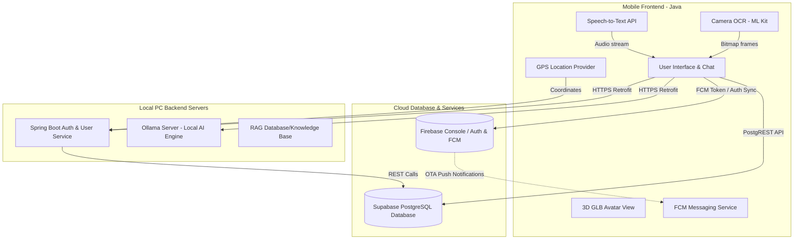

# 🎓 LocalLLMChat: Architecture & Exam Study Guide

This project is a high-performance, privacy-first Android application that integrates edge-based AI reasoning, cloud storage synchronization, real-time push messaging, 3D graphics rendering, and local OCR camera services.

---

## 🗺️ 1. High-Level System Architecture

Your project is built using a **hybrid distributed architecture**. It combines **local edge processing** (for privacy, low-latency AI inference, and local database services) with **secure cloud databases and notifications** (Supabase and Firebase).

### Architecture Workflow Diagram

### 💡 Key Architectural Design Decisions:
1. **Hybrid Privacy Model**: Highly secure or lightweight analytical data (location logs, notification tokens) is managed in the cloud via Supabase and Firebase. However, heavy language processing and user chat prompts are run 100% locally on the user's host machine via Ollama, guaranteeing absolute user privacy.
2. **Communication Layer**: Front-to-back communication is managed asynchronously via **Retrofit2** running on top of an OkHttp transport layer. Service URLs can be dynamically reconfigured at runtime through the app's diagnostic "Server Settings" dialog.

---

## 🧠 2. Local AI & RAG Integration (Ollama + DeepSeek-R1)

### Local LLM: DeepSeek-R1
* **Ollama Platform**: An offline neural engine orchestrator that hosts open-weights language models. It handles low-level hardware acceleration (using CUDA/Vulkan for GPUs or AVX2 for CPUs) and exposes a clean local REST API on port `11434`.
* **Model Selection**: **DeepSeek-R1**. This model utilizes a dynamic "Chain-of-Thought" (CoT) system to output its internal reasoning steps before generating final responses.
* **Model Parameters**: 
  * Typically deployed at **1.5 Billion (1.5B)** or **7 Billion (7B)** parameters for local systems. 
  * *Parameters* are the internal variables (weights and biases) that define the model's intelligence. A 7B parameter model is significantly more accurate and structured but requires at least 5GB of free VRAM, while a 1.5B model is faster and runs on less powerful hardware.

### RAG (Retrieval-Augmented Generation)
* **What is it?**: An engineering pattern that enhances LLM accuracy by retrieving external context relative to a user's prompt before generating a response.
* **The Architecture Workflow**:
  1. **Query Capture**: The user enters a question.
  2. **Context Retrieval**: If the RAG switch is enabled, the backend performs a semantic vector search on private local files (e.g. text documents, logs) to find relevant sentences.
  3. **Prompt Augmentation**: The retrieved data is injected directly into a hidden system instruction sent to the LLM.
  4. **Generation**: The LLM responds based on the verified facts provided in the prompt context, eliminating AI hallucinations.

---

## ⚡ 3. Supabase Cloud Sync & Smart Location Logging

* **Supabase Client**: Uses standard Retrofit interfaces to call the Supabase PostgREST database layer over standard HTTPS.
* **Smart History Logging Flow**:
  1. Upon logging in, Android's **Fused Location Provider** fetches the device's current GPS coordinates (Latitude/Longitude).
  2. The app issues an HTTP **`POST`** to insert a new row in a dedicated `location_logs` database table.
  3. **Fallback Logic**: If the database throws a `409 Conflict` (unique username key violation), the client automatically intercepts the error and executes an HTTP **`PATCH`** (`updateUserLocation`) to overwrite the single profile log instead, preventing application crashes.

---

## 🔔 4. Firebase Messaging & Smart Authentication Sync

### Push Notifications
* **FCM Registration**: On startup, the app registers with Google Play Services to obtain a device-specific Firebase Cloud Messaging token.
* **Background/Foreground Dispatching**:
  * Foreground notifications are intercepted by `MyFirebaseMessagingService.onMessageReceived` and drawn using custom UI builders.
  * Background notifications are captured and shown natively by the Firebase Client SDK.
* **The Android 13+ Hurdles**:
  * Added runtime prompt requesting `POST_NOTIFICATIONS` permission alongside `<uses-permission android:name="android.permission.POST_NOTIFICATIONS" />` in the manifest.
  * Designed the high-importance channel `fcm_default_channel_v2` (`NotificationManager.IMPORTANCE_HIGH`) to force pop-up heads-up notification banners.

### Smart Authentication Sync
* **Signup**: Successful local registration triggers `FirebaseAuth.getInstance().createUserWithEmailAndPassword(email, password)` to create a matching secure login profile in Firebase.
* **Login Auto-Recovery**: Successful local login logs the user into Firebase. If a user accounts exists locally but not in Firebase yet, the app catches the invalid user exception and registers them on the fly in Firebase Auth!

---

## 🕶️ 5. Advanced Mobile Components

### 1. 3D GLB Avatar Rendering
* **Implementation**: Uses a full-screen, hardware-accelerated **Android WebView**.
* **Bridge**: WebView loads local HTML5/JavaScript assets containing Google's **`<model-viewer>`** web component.
* **Model Handling**: Renders `model.glb` (Binary glTF) featuring dynamic studio lighting, orbital camera rotators, zoom scaling, and shadows.

### 2. Camera OCR Text Scanner
* **Camera Framework**: Built with **Jetpack CameraX** to manage modern hardware captures.
* **Machine Learning**: Integrates **Google ML Kit's local Text Recognition API**.
* **Workflow**: The user targets an object, clicks scan, CameraX captures a Bitmap frame, ML Kit extracts text strings, and returns the result to `MainActivity` to insert it directly into the message text field.

### 3. Voice Speech-to-Text
* Uses Android's native `RecognizerIntent` dialog to record high-fidelity voice inputs, runs local recognition algorithms to map words, and returns string matching arrays to automate hands-free messaging.
