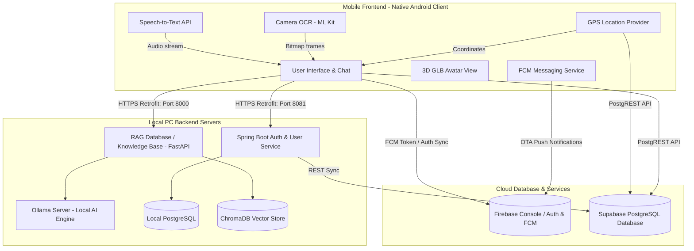
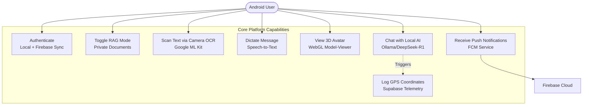
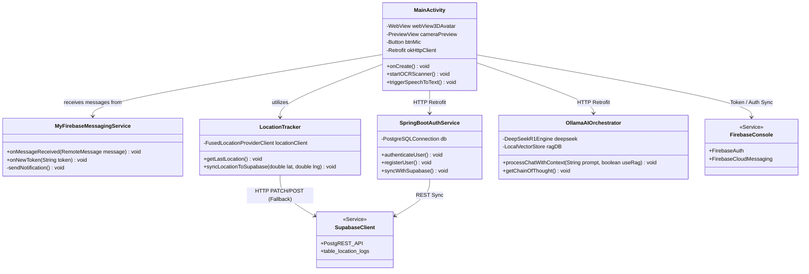
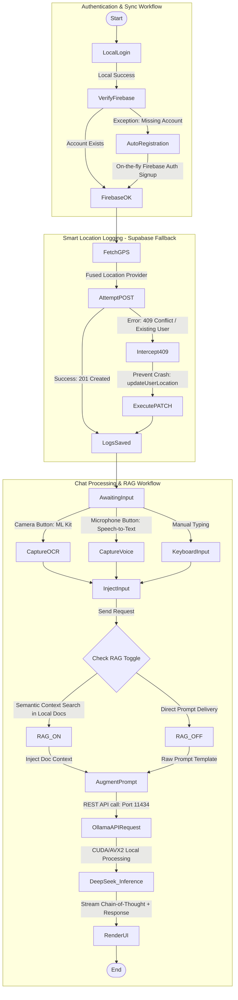
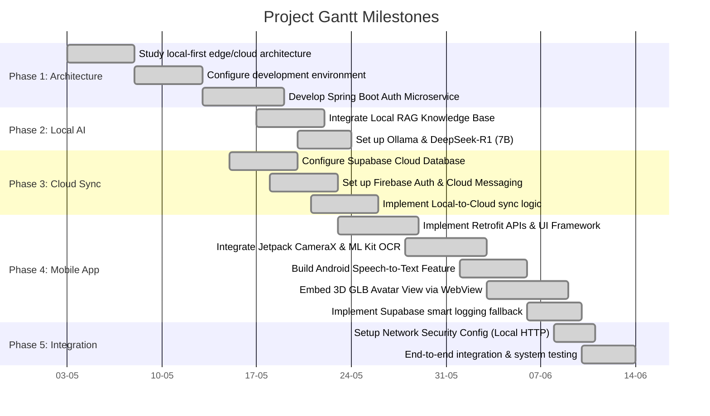

[](https://developer.android.com)
[](https://spring.io)
[](https://www.trychroma.com)
[](https://ollama.com)

---

### 1. Unified System Deployment & Topology

The following diagram maps the computational boundaries, networking interfaces, and communication channels across the system:



### 2. Platform Use Cases & Operator Capabilities

Operators utilize the Android client as a command portal to execute location syncing, private document scanning, voice transcriptions, and interactive WebGL sessions:



### 3. Android Client Class Structure & Dependencies

The class diagram below outlines the native Java structure of the Android application, detailing key controller scopes and sensor bindings:



---

## 🔄 Execution Lifecycle & Telemetry Flow

The flowchart below walks through the runtime lifecycle of the system—from multi-database user authentication matching to location logging fallbacks and vector-augmented LLM inference:



---

## ⚡ Core Features & Engineering Mechanics

### 1. Hybrid Multi-Database Auth Sync (PostgreSQL + Firebase)
*   **Mechanic:** To prevent authorization discrepancies across different services, our registration flow synchronizes account credentials. The client registers profiles securely in the local **PostgreSQL** database via the **Spring Boot microservice**, while simultaneously creating matching user accounts in **Firebase Authentication**.
*   **On-the-Fly Registration Fallback:** During logins, if a user successfully authenticates against Spring Boot but does not yet exist in Firebase Auth (e.g., they were registered directly in the SQL database without using the app), the client catches the missing account exception and automatically registers them in Firebase Auth on-the-fly (`createUserWithEmailAndPassword`), ensuring a unified authentication state.

### 2. Smart Location Logging & Supabase Fallback (Supabase REST)
*   **Mechanic:** The Android client periodically queries the FusedLocationProvider chipset and sends coordinates to the cloud.
*   **Conflict Fallback Logic:** The app makes `POST` requests to Supabase PostgREST endpoints. If a row conflict occurs (Unique Username constraint violation / HTTP `409 Conflict`), the app intercepts the network exception and falls back to an HTTP `PATCH` query (`updateUserLocation`) to update the telemetry in place. This prevents duplicate database records and ensures clean, crash-free cloud synchronization.

### 3. Locally Processed Camera OCR (CameraX + Google ML Kit)
*   **Mechanic:** Uses **Android CameraX** to run a preview viewport and capture high-resolution images. The app feeds captured bitmaps directly to **Google ML Kit Vision (Text Recognition)** APIs locally on the device. Text is extracted offline with zero network latency, allowing operators to edit, copy, or pipe scanned content directly into their active conversational prompts.

### 4. Interactive 3D Holographic Assistant (Three.js WebGL & TTS)
*   **WebGL Rendering:** The front-end renders a 3D avatar within a hardware-accelerated WebView loading local assets (Three.js canvas and `model_1.glb`).
*   **Dynamic Lip Syncing:** During voice playback, a Java loop samples the output audio envelope from **TextToSpeech** at **20 FPS** to compute speech intensity. This intensity is passed to JavaScript via `setVoiceIntensity(amplitude)` to drive the avatar's morph targets (`jawOpen`, `mouthOpen`, `viseme_aa`), creating realistic mouth movements.
*   **Skeletal Gestures:** When the assistant speaks, sine-wave rotation calculations are applied to structural bones (`spineBone`, `headBone`, `leftArmBone`, `rightArmBone`), producing life-like nodding, arm waves, and breathing motions.
*   **Premium Male Voice:** The client scans the system TTS voice list for premium masculine engines (`male`, `-x-smg`, etc.) and scales the pitch down to `0.82f`, outputting a natural, deep male voice.

### 5. Localized Retrieval-Augmented Generation (ChromaDB + FastAPI)
*   **Multi-Format File Ingestion:** Users can select PDF, DOCX, or TXT documents directly from the Android app. The files are uploaded via a multipart HTTP request to the FastAPI server, which extracts the raw text and splits it into chunks of ~500 characters.
*   **Semantic Vector Embedding:** Uses ChromaDB with the `all-MiniLM-L6-v2` embedding model to transform chunks into 384-dimensional vector coordinates.
*   **Prompt Augmentation:** During conversations, ChromaDB retrieves the top two most semantically relevant context blocks matching the user query, combining them into the final prompt context before forwarding it to the local LLM.

---

## 📅 Development Milestones & Timeline

The project development was executed systematically across five key sprints:



---

## 📂 Project Repository Structure

```
NeuroLink/
├── LocalLLMChat/                     # Native Android Mobile Client (Java)
│   ├── app/
│   │   ├── src/main/
│   │   │   ├── java/com/nidrami/localchat/
│   │   │   │   ├── MainActivity.java           # Central UI & Conversational Coordinator
│   │   │   │   ├── AvatarActivity.java         # 3D Avatar Controller & Lip Sync Engine
│   │   │   │   ├── CameraActivity.java         # CameraX Viewport & ML Kit OCR parser
│   │   │   │   ├── DashboardActivity.java      # Telemetry logs & document uploader
│   │   │   │   ├── LoginActivity.java          # Authentication & Supabase GPS Sync
│   │   │   │   ├── SupabaseClient.java         # Cloud database connection pool
│   │   │   │   └── MyFirebaseMessagingService.java  # FCM Token & Notification system
│   │   │   ├── assets/
│   │   │   │   ├── 3d_avatar.html              # WebGL Three.js Scene Engine
│   │   │   │   └── model_1.glb                 # Renamed 3D Avatar Asset (13.8MB)
│   │   │   └── res/layout/                     # Activity UI XML Mappings
│   │   └── build.gradle.kts                    # App dependencies & compilation keys
│   └── build.gradle.kts
│
├── local-llm-backend/                 # FastAPI & Local RAG Orchestration Backend (Python)
│   ├── server_with_vectordb.py       # Core API, ChromaDB collector & PDF extractor
│   ├── documents/                     # Temporary ingestion storage folder
│   └── vector_db/                     # Persistent local ChromaDB storage
│
├── user_service_localLLM/             # Security & User Authentication Service (Spring Boot)
│   ├── src/main/
│   │   ├── java/com/.../              # Controllers, JPA repositories & JWT Filters
│   │   └── resources/
│   │       └── application.properties # PostgreSQL configuration profiles
│   └── pom.xml                        # Maven dependencies config
```

---

## 💾 Core Database Schemas

To facilitate rapid deployment, configure your local and cloud database clusters using the following definitions:

### 1. Local Authentication Database (PostgreSQL)
Managed through Hibernate inside the Spring Boot container:
```sql
CREATE TABLE users (
    id BIGSERIAL PRIMARY KEY,
    username VARCHAR(50) UNIQUE NOT NULL,
    password VARCHAR(100) NOT NULL, -- BCrypt Hash
    email VARCHAR(100) UNIQUE NOT NULL,
    first_name VARCHAR(50),
    last_name VARCHAR(50),
    role VARCHAR(20) DEFAULT 'USER',
    latitude DOUBLE PRECISION,
    longitude DOUBLE PRECISION
);
```

### 2. Telemetry Cloud Databases (Supabase PostgreSQL)
Syncs real-time telemetry logs and conversational history:
```sql
-- Login Location History Tracker
CREATE TABLE login_locations (
    username VARCHAR(50) PRIMARY KEY, -- Single entry fallback row
    latitude DOUBLE PRECISION NOT NULL,
    longitude DOUBLE PRECISION NOT NULL,
    login_time TIMESTAMP WITH TIME ZONE DEFAULT TIMEZONE('utc', NOW())
);

-- Continuous Location Logger
CREATE TABLE location_logs (
    id BIGSERIAL PRIMARY KEY,
    username VARCHAR(50) NOT NULL,
    latitude DOUBLE PRECISION NOT NULL,
    longitude DOUBLE PRECISION NOT NULL,
    created_at TIMESTAMP WITH TIME ZONE DEFAULT TIMEZONE('utc', NOW())
);

-- Chronological Conversation Logbook
CREATE TABLE chat_history (
    id BIGSERIAL PRIMARY KEY,
    username VARCHAR(50) NOT NULL,
    sender VARCHAR(20) NOT NULL, -- 'user' or 'assistant'
    message TEXT NOT NULL,
    created_at TIMESTAMP WITH TIME ZONE DEFAULT TIMEZONE('utc', NOW())
);
```

---

## 🌐 Complete API Endpoint Reference

### 1. Spring Boot User Service (Port `8081`)
| Endpoint | Method | Payload | Description |
| :--- | :--- | :--- | :--- |
| `/api/auth/register` | `POST` | `UserSignupRequest` | Registers new operator, hash-codes password, captures signup GPS coordinates, and matches with Firebase. |
| `/api/auth/login` | `POST` | `UserLoginRequest` | Validates local parameters and generates a secure 24h JWT authorization token. |
| `/api/users/location` | `PUT` | `LocationUpdateRequest` | Intercepts ongoing device movements and saves updated coordinates in Postgres. |

### 2. FastAPI Local RAG Orchestrator (Port `8000`)
| Endpoint | Method | Payload | Description |
| :--- | :--- | :--- | :--- |
| `/chat` | `POST` | `ChatRequest` | Core AI route. If RAG is on, embeds prompt, searches ChromaDB, compiles prompt context, and returns DeepSeek-R1 output. |
| `/upload` | `POST` | `Multipart/Form-Data` | Document ingestion. Saves files temporarily, extracts text (PDF, DOCX, TXT), chunks content, embeds vectors, and indexes into ChromaDB. |
| `/documents` | `GET` | *None* | Pulls listing of currently indexed local system documents and active vector chunks. |

---

## 🔧 Installation & Configuration Guide

### 1. Local Database Configuration (PostgreSQL)
Ensure you have a local PostgreSQL instance running. Create the primary authentication database:
```sql
CREATE DATABASE local_llm_db;
```

### 2. User Service Configuration (Spring Boot)
1. Open [`user_service_localLLM/src/main/resources/application.properties`](user_service_localLLM/src/main/resources/application.properties).
2. Configure your PostgreSQL credentials and server port:
   ```properties
   server.port=8081
   spring.datasource.url=jdbc:postgresql://localhost:5432/local_llm_db
   spring.datasource.username=YOUR_POSTGRES_USER
   spring.datasource.password=YOUR_POSTGRES_PASSWORD
   ```
3. Run the microservice using Maven:
   ```bash
   mvn clean install
   mvn spring-boot:run
   ```

### 3. Ingestion & RAG Setup (FastAPI & Ollama)
1. Install system requirements:
   ```bash
   pip install fastapi uvicorn pydantic ollama chromadb sentence-transformers PyPDF2 python-docx
   ```
2. Pull and start your local Ollama instance with **DeepSeek-R1**:
   ```bash
   ollama pull deepseek-r1:7b
   ```
3. Start the FastAPI server on port `8000`:
   ```bash
   python server_with_vectordb.py
   ```

### 4. Client Deployments & Base URL Mapping
1. Load `LocalLLMChat` into **Android Studio**.
2. Configure Cloud Keys in [`SupabaseClient.java`](LocalLLMChat/app/src/main/java/com/nidrami/localchat/SupabaseClient.java):
   ```java
   public static final String SUPABASE_URL = "https://YOUR_SUPABASE_PROJECT.supabase.co/";
   public static final String SUPABASE_KEY = "YOUR_ANON_PUBLIC_KEY";
   ```
3. Add your `google-services.json` inside `LocalLLMChat/app/` to sync Firebase.
4. Build and deploy the application to your emulator or physical Android handset.

---

## 🌐 Local Network Resiliency & Troubleshooting

During development on local networks (such as school or office Wi-Fi with **AP Isolation** active), mobile devices may fail to connect to local development ports (`8080`, `8081`, or `8000`).

To resolve connection issues:
*   **Android Emulator Loopback:** Use the preset loopback host `10.0.2.2` in `LoginActivity` to route connections directly to the development system hosting your servers.
*   **Local System Hotspots:** Connect both your PC and your mobile handset to the same mobile hotspot. Use your PC's IPv4 address (`ipconfig` in CMD) as the host IP in the mobile app.
*   **Secure Tunneling (Ngrok):** Tunnel your local servers to expose them securely over public URLs:
    ```bash
    ngrok http 8081
    ngrok http 8000
    ```
    Paste the generated public HTTPS URLs directly into `SessionManager`'s network input fields inside the app.

---

## 📄 License & Contributions

NeuroLink is licensed under the Apache 2.0 License. Contributions are welcome! Please open an issue or submit a pull request for any sensory system improvements, prompt enhancements, or performance optimizations.
